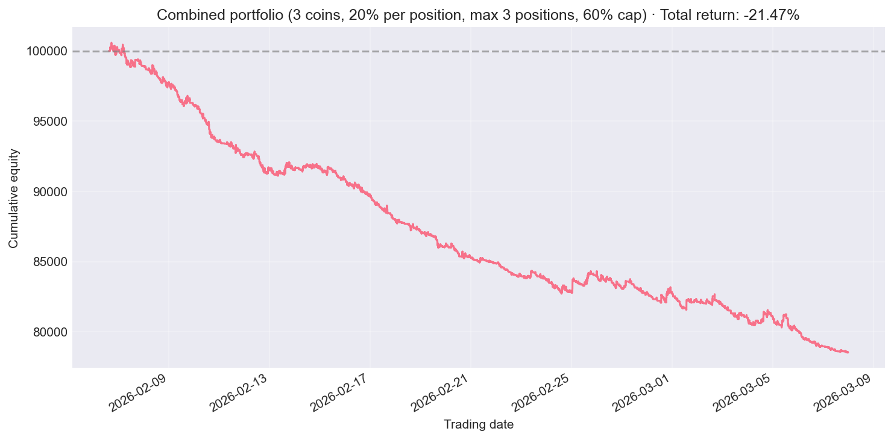

# Combined Portfolio Backtest Report

**Strategy:** Multi-symbol shared portfolio.
- 20% of current cash per new position.
- Max 3 open positions (across symbols).
- Total exposure ≤ 60% of equity.

**Period:** 2026-02-06 to 2026-03-08
**Generated:** 2026-03-09 01:28:16

## Performance

| Metric | Value |
|--------|-------|
| Total Return (%) | -21.47 |
| Annualized Return (%) | -0.21 |
| Sharpe Ratio | -5.8611 |
| Max Drawdown (%) | -21.92 |
| Calmar Ratio | -0.0095 |
| Volatility (ann.) | 0.38% |

## Trade Statistics

| Metric | Value |
|--------|-------|
| Total Trades | 1349 |
| Winning Trades | 302 |
| Losing Trades | 1047 |
| Win Rate (%) | 22.39 |
| Profit Factor | 0.5300 |
| Total PnL | -21468.64 |
| Avg Holding Period | 0.40 |
| Max Consecutive Losses | 25 |

## Equity Curve

